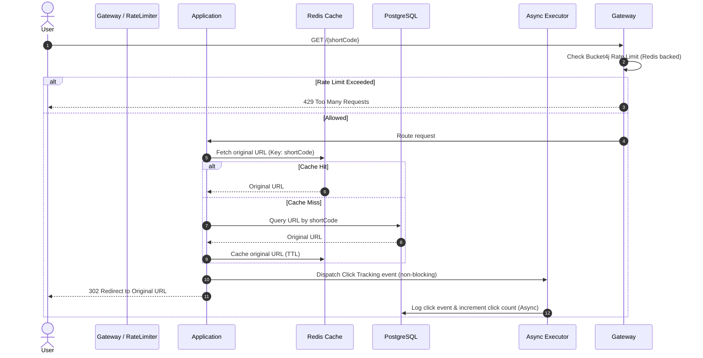

# Shortlink - High-Performance URL Shortening Service

[](https://www.oracle.com/java/technologies/javase/jdk21-archive-downloads.html)
[](https://spring.io/projects/spring-boot)
[](https://redis.io/)
[](https://opensource.org/licenses/MIT)

Shortlink is a production-ready, high-performance URL shortening backend service built on **Spring Boot 4.0.6** and **Java 21**. It integrates distributed ID generation (**Snowflake**), high-speed **Redis Caching**, and asynchronous processing to achieve sub-millisecond redirect latencies and high write throughput under heavy load.

---

## 🏛 Architecture & Design Choices

The service leverages a highly scalable, distributed-first architecture:



### 1. Distributed ID Generation (Snowflake)
Instead of relying on database auto-incrementing IDs or generating heavy random UUIDs, Shortlink uses a distributed **Snowflake ID Generator**.
- **Collision-free**: Generates unique IDs across multi-datacenter, multi-node clusters.
- **Time-ordered**: Monotonically increasing IDs optimize B-Tree index insertions in the database.
- **Base62 Encoding**: The generated 64-bit numerical ID is converted to a Base62 string (`0-9`, `a-z`, `A-Z`), yielding short, clean codes (e.g., `8YhP9x`).

### 2. High-Speed Redirection Path
To handle read traffic efficiently:
- The system employs a **Cache-Aside Pattern** using Redis. Successful redirects are served directly from Redis, bypassing the database entirely.
- Distributed Rate Limiting is enforced at the controller layer via **Bucket4j** with a Redis backing store, safeguarding the application against denial-of-service attempts.

---

## ⚡ Performance Optimizations

Recently, the service underwent a deep refactoring cycle to eliminate Spring Boot code smells, resolve critical JPA bottleneck issues, and maximize API concurrency:

### 1. Stateless Security Authentication
- **Problem**: The security filter queried the database to retrieve user details on *every single incoming API request*, creating a massive database read bottleneck under high traffic.
- **Solution**: 
  - Enhanced [JwtService](file:///d:/Languges/java/shortlink/src/main/java/com/hoaitran/shortlink/service/JwtService.java) to pack key claims (`userId`, `email`, `role`) directly into the JWT payload.
  - Refactored [JwtAuthenticationFilter](file:///d:/Languges/java/shortlink/src/main/java/com/hoaitran/shortlink/security/JwtAuthenticationFilter.java) to parse these claims and reconstruct the security context in memory.
  - Implemented a defensive database fallback lookup to handle legacy tokens seamlessly.
- **Impact**: Database reads for authentication reduced from $O(N)$ requests to $O(0)$ (for non-legacy requests).

### 2. Asynchronous Click Metrics Tracking
- **Problem**: The redirection endpoint `GET /{shortCode}` was executing inside a heavy read-write database transaction (`@Transactional`), locking rows to increment click counts and insert new click log entries before returning the HTTP 302 status code. This caused severe write contention and latency spikes.
- **Solution**:
  - Enabled asynchronous execution in [ShortlinkApplication](file:///d:/Languges/java/shortlink/src/main/java/com/hoaitran/shortlink/ShortlinkApplication.java) via `@EnableAsync`.
  - Created a dedicated asynchronous metrics executor in [ClickEventService](file:///d:/Languges/java/shortlink/src/main/java/com/hoaitran/shortlink/service/ClickEventService.java) annotated with `@Async` to update counts and write [ClickEvent](file:///d:/Languges/java/shortlink/src/main/java/com/hoaitran/shortlink/entity/ClickEvent.java) logs in a background thread pool.
  - Removed `@Transactional` from [LinkService](file:///d:/Languges/java/shortlink/src/main/java/com/hoaitran/shortlink/service/LinkService.java)'s retrieval flow.
- **Impact**: Redirection latency reduced to sub-millisecond levels, decoupling heavy write operations from the response path.

### 3. High-Performance Bulk Deletion for Expired Links
- **Problem**: The link cleanup background worker ([LinkCleanupTask](file:///d:/Languges/java/shortlink/src/main/java/com/hoaitran/shortlink/task/LinkCleanupTask.java)) loaded expired [Link](file:///d:/Languges/java/shortlink/src/main/java/com/hoaitran/shortlink/entity/Link.java) entities in-memory one-by-one to delete them along with their cascading children, causing high memory usage, potential Out-Of-Memory (OOM) risks, and lock contention.
- **Solution**:
  - Implemented optimized bulk JPQL deletion queries in [LinkRepository](file:///d:/Languges/java/shortlink/src/main/java/com/hoaitran/shortlink/repository/LinkRepository.java) and [ClickEventRepository](file:///d:/Languges/java/shortlink/src/main/java/com/hoaitran/shortlink/repository/ClickEventRepository.java).
  - Modified the scheduled task to execute the deletions sequentially at the database level without loading the entities into Java memory.
- **Impact**: Dramatically reduced database transaction lock durations and eliminated Java heap consumption during cleanup tasks.

### 4. Database Query Tuning & Indexing
- **Problem**: As dataset sizes scaled, filtering by expiry date or joining link records with metrics caused full table scans.
- **Solution**:
  - Added a database index on the `expires_at` column in [Link](file:///d:/Languges/java/shortlink/src/main/java/com/hoaitran/shortlink/entity/Link.java) to speed up scheduler queries.
  - Added a database index on the `link_id` foreign key column in [ClickEvent](file:///d:/Languges/java/shortlink/src/main/java/com/hoaitran/shortlink/entity/ClickEvent.java) to optimize analytics joins.

---

## 🔒 Security Architecture

### 1. Mitigation of Insecure Direct Object Reference (IDOR)
- **Problem**: The initial API schema allowed the client to submit a `userId` parameter in [ShortenRequest](file:///d:/Languges/java/shortlink/src/main/java/com/hoaitran/shortlink/dto/request/ShortenRequest.java), enabling malicious users to generate links on behalf of other accounts by manipulating the payload.
- **Solution**: Removed the `userId` field from [ShortenRequest](file:///d:/Languges/java/shortlink/src/main/java/com/hoaitran/shortlink/dto/request/ShortenRequest.java) entirely. The authenticated user is now extracted securely and implicitly from the server's Spring Security Context inside [LinkController](file:///d:/Languges/java/shortlink/src/main/java/com/hoaitran/shortlink/controller/LinkController.java).

### 2. Strict URL Validation (XSS & Open Redirect Protection)
- **Problem**: Accepting arbitrary URLs could lead to cross-site scripting (XSS) via `javascript:` protocols, or malicious phishing links.
- **Solution**: Developed a custom Hibernate validator [ValidUrl](file:///d:/Languges/java/shortlink/src/main/java/com/hoaitran/shortlink/validation/ValidUrl.java) and [UrlValidator](file:///d:/Languges/java/shortlink/src/main/java/com/hoaitran/shortlink/validation/UrlValidator.java) class. It enforces RFC-compliant URL patterns, verifies host existence, and strictly restricts allowed protocols to `http` and `https`.

---

## 🛠 Tech Stack

- **Framework**: Spring Boot 4.0.6 (Spring Web, JPA, Security, Actuator, Cache)
- **Language**: Java 21
- **Databases**: PostgreSQL 16 (production profile), MySQL 8 (supported)
- **Caching & Rate Limiting**: Redis, Bucket4j
- **APIs & Security**: JSON Web Token (JJWT), Spring Security, Springdoc OpenAPI 3 (Swagger UI)
- **Containerization**: Docker, Docker Compose

---

## ⚙️ Configuration & Environment

Environment variables are managed dynamically via a `.env` file. Copy the example template to get started:

```bash
cp .env.example .env
```

Key configuration properties in `src/main/resources/application.properties`:
- `snowflake.worker-id`: Distinguishes between multiple running instances of the app (value `0-31`).
- `snowflake.datacenter-id`: Distinguishes between datacenters (value `0-31`).
- `jwt.secret`: Strong HMAC-SHA signature key.
- `app.ratelimit.capacity` & `app.ratelimit.tokens-per-minute`: Custom rate limit configurations.

---

## 🏃 Running the Application

### 🐳 Option 1: Docker Compose (Recommended)
Launches the application server, PostgreSQL database, and Redis cache in complete isolation.

```bash
docker-compose up -d --build
```
The application will start at `http://localhost:8080`.

### 💻 Option 2: Local Run (Development)
Ensure local instances of Redis and PostgreSQL/MySQL are running, then configure `.env` accordingly.

1. **Build and package the application**:
   ```bash
   mvn clean install
   ```
2. **Start the Spring Boot application**:
   ```bash
   mvn spring-boot:run
   ```

---

## 📖 API Documentation & Monitoring

| Component | URL | Purpose |
| :--- | :--- | :--- |
| **Swagger UI** | `http://localhost:8080/swagger-ui/index.html` | Interactive REST API exploration |
| **OpenAPI Docs** | `http://localhost:8080/v3/api-docs` | Raw OpenAPI JSON specification |
| **Actuator health** | `http://localhost:8080/actuator/health` | Live system health checks |

### Core Endpoints

* **Authentication**: `POST /api/auth/register`, `POST /api/auth/login`
* **Shorten URL**: `POST /api/shorten` (Authenticated)
* **Redirect**: `GET /{shortCode}` (Public, cached, rate-limited)
* **Statistics**: `GET /api/clicks/{linkId}` (Authenticated, paginated metrics list)

---

## 🧪 Test Suite

The codebase includes a comprehensive set of unit and integration tests covering security, async processes, bulk operations, and URL validation.

To execute the test suite:
```bash
mvn test
```
